<h1 align ="center" id = "top">Kingsland Test file
<h1>

<h2 align="center">
    <a href="" target="_blank">Kingsland Website</a>
</h2>

<h3 align="center">
    <a href="https://github.com/TezBaydu/Milestone-Project-4-GraphicDesign#README" target="_blank">Back to README file</a>
</h3>

## Contents
1. [Commits](#Commits)
2. [User Story testing](#User-Story-testing)
    - [Browsers](#Browsers)
    -[Customers](#Customers)
    -[Designer](#Designer)
    - [Web Developer](#Web-Developer)
3. [Code testing](#Code-testing)
    - [HTML5](#HTML5)
    - [CSS3](#CSS3)
    - [JavaScript](#JavaScript)
    -[PEP8](#Python-PEP8)
4. [Element testing](#Element-testing)
    - [Navigation bar](#Navigation-bar)
    - [Scroll Top button](#Scroll-Top-button)
    - [Footer](#Footer)
    - [Locations section](#Locations-section)
        * [Read More](#Read-More)
        * [Map Markers](#Map-Markers)
        * [Interest Cards](#Interest-Cards)
    - [Contact section](#Contact-section)
    - [Email format](#Email-format)
5. [Device testing](#Device-testing)
6. [Colour blindness testing](#Colour-blindness-testing)
    - [Protanopia](#Protanopia)
    - [Deuteranopia](#Deuteranopia)
7. [Browser testing](#Browser-testing)
8. [User testing](#User-testing)
    - [Bugs and Issues](#Bugs-and-Issues)

## Commits
- Over 180 commits
- Commits made in as many instances as possible however there have been instances where code had to be revised but when passed certain stages of development it was thought best to carry the commits instead of branching.

[Back to top ⇧](#top)

## User Story testing

### Browsers
The user is wanting to design ideas for logos

* This user wants to:
1. Be able to navigate through the website easily.
    - Responsive collapsible fixed nav menu for user to see more of screen and be able to navigate when required.
    - Various links to other pages.
2. View designs of other projects.
    - Logos linked to relevant case study at home page.
    - Designs used in various formats.
    - Easy filter options for each case study.
3. Be able to navigate to relevant social links.
    - Always an option to select from fixed footer.
4. Be able to make contact for queries and newsletter sign up.
    - Easy to gain contact via navbar of from link in footer.
    - Immediate contact made through auto notification.
    - Email notification sent to user contact has been made.

### Customers
The user is wanting to make a purchase to obtain a business logo
*   This user wants to:
1. Be able to navigate through the website easily.
    - Responsive collapsible fixed nav menu for user to see more of screen and be able to navigate when required.
    - Various links to other pages.
    - Able to login from nav bar.
    - Local data can store login details even though password is not passed through to database.
2. Easily view designs and case studies of design impact.
    - Logos linked to relevant case study at home page.
    - Easy filter options for each case study.
3. Be able to navigate to relevant social links.
    - Always an option to select from fixed footer.
4. Be able to create a profile which is editable.
    - Profile is created upon registration.
    - Profile will hold editable details.
    - User name and email is non editable to ensure orders are associated to origin user source
5. Ability to make a purchase
    - Bag store and checkout function on registration.
    - Secure payment system utilising Stripe facility.
    - Warnings showing failure if values are incorrect.
6. Be able to view order history.
    - Profile holds order history.
    - Shows summary but has link to order detail and reference number.
7. Be able to make contact for queries and newsletter sign up.
    - Easy to gain contact via navbar of from link in footer.
    - Immediate contact made through auto notification.
    - Email notification sent to user contact has been made.
    - Username and email updated if registered.

### Designer
This user is the site owner (or could be employed by the site owner to produce logo designs)

* The user wants to:
1. Receive notification of orders with purchase confirmation.
    - Once purchases are made details are stored in admin and email notification sent to Designer.
2. Have some detail on what is being requested to be designed.
    - Some detail on emails but to view Admin for full instruction.
3. Be able to receive notification of contact queries directly from website.
    - Email notification received when queries are made showing customer message.
4. Be able to identify orders from a user to action.
    - Email notification shows reference to order where full details can be obtained from Admin.

### Web Developer
This user is looking for imagery or influence for another project.

* They want to be able to:
1. Have easy navigation.
    - Responsive collapsible fixed nav menu for user to see more of screen and be able to navigate when required.
    - Various links to other pages.
2. Be able to make contact with Developer/Site Owner.
    - Able to make contact through contact / enquiry page of site.
3. Have an opportunity to clone site if wanting to use content.
    - Readme can be shared which has secure details of ability to colne repository
4. Option to access repository if authorised
    1. Find how the website was created.
        - [README.md](https://github.com/TezBaydu/Milestone-Project-4-GraphicDesign#introduction) file created detailing why and how website was created.
        - Contact form can also be used for General enquiries.
    2. Be able to make contact with Developer.
        - Contact form can be used for general enquiries.
        - [README.md Deployment](https://github.com/TezBaydu/Milestone-Project-4-GraphicDesign#Deployment) has description of cloning and forking and therefore contact can be made via GitHub.
    3. Have an opportunity to clone site if wanting to use content.
        - [README.md Cloning](https://github.com/TezBaydu/Milestone-Project-4-GraphicDesign#Cloning-a-repository) has description of cloning.

[Back to top ⇧](#top)

## Code Testing

### HTML5
- [HTML code checker](https://validator.w3.org/)
     
    - Tests during development, record stored below
    - Test date 21/01/2022
        - HTML5 test
            * Home
                - 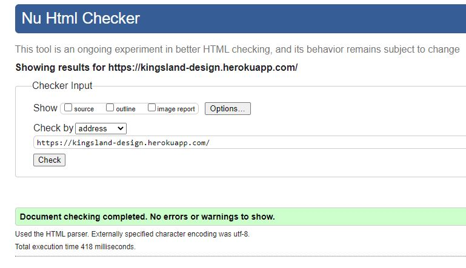
            * Case Studies
                - 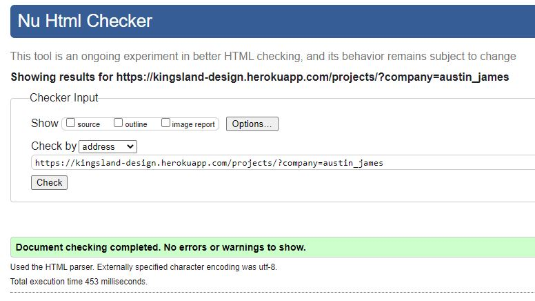
            * Packages
                - 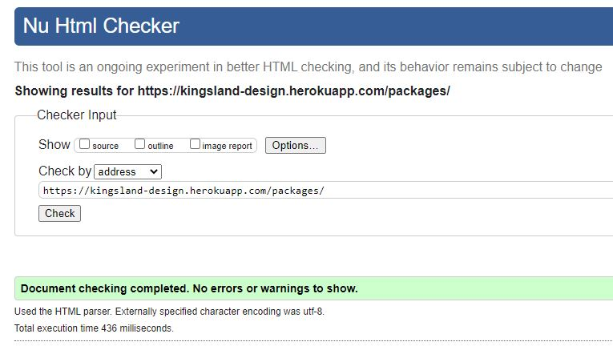
            * Packages Detail
                - 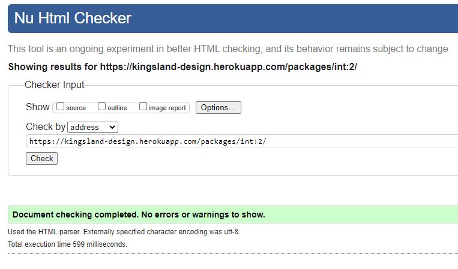
            * Add Package
                - 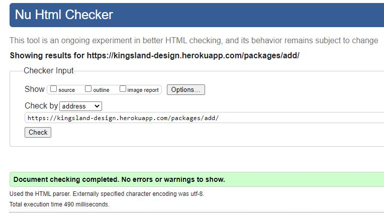
            * Edit Package
                - 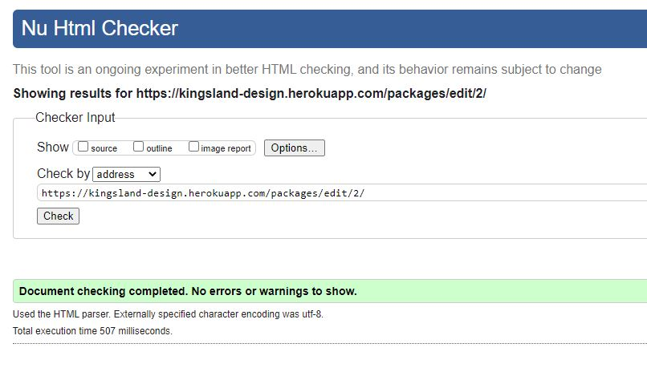          
            * Bag
                - 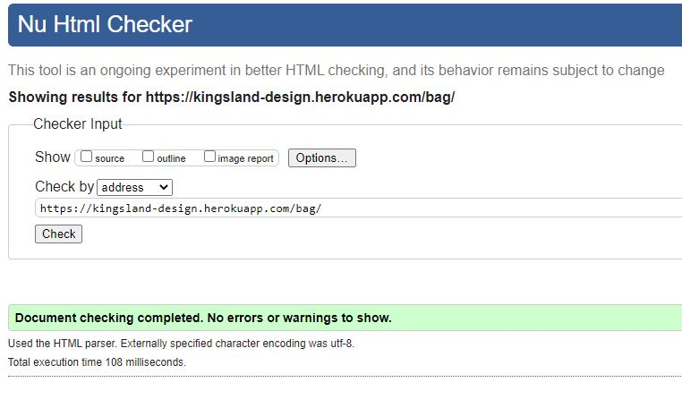
            * Checkout
                - 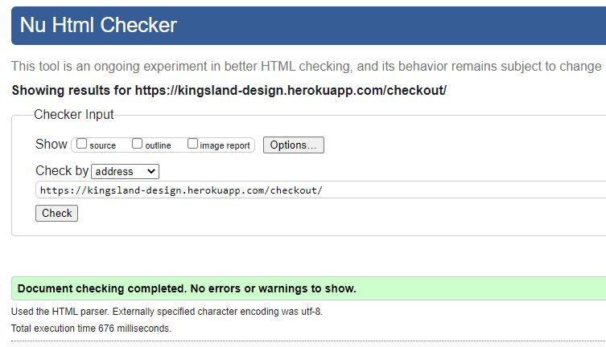
            * Checkout Success
                - 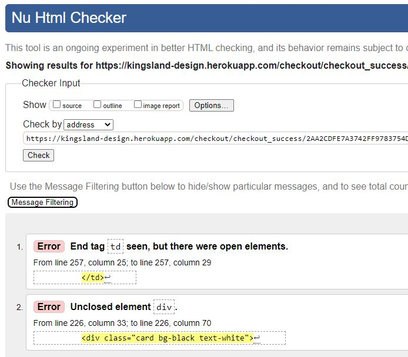
                    * Errors due to if statements to call associated package.
                    * Acceptable as functional in front end.
            * Contact 
                - 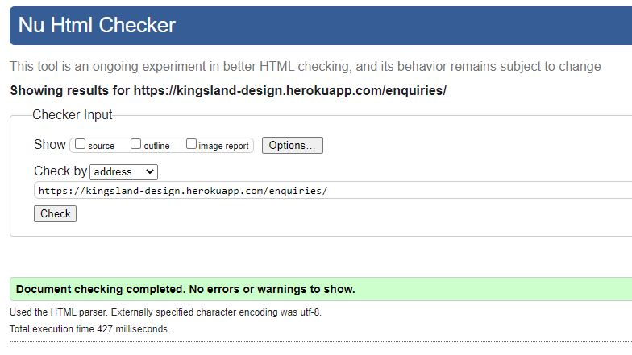
            * Profile
                - 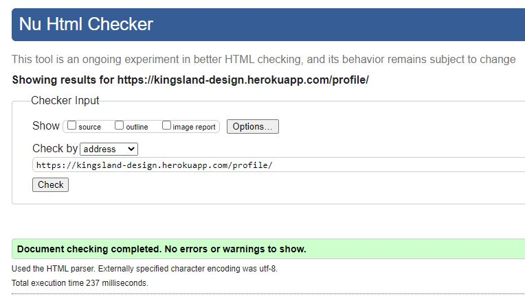
            * Login
                - 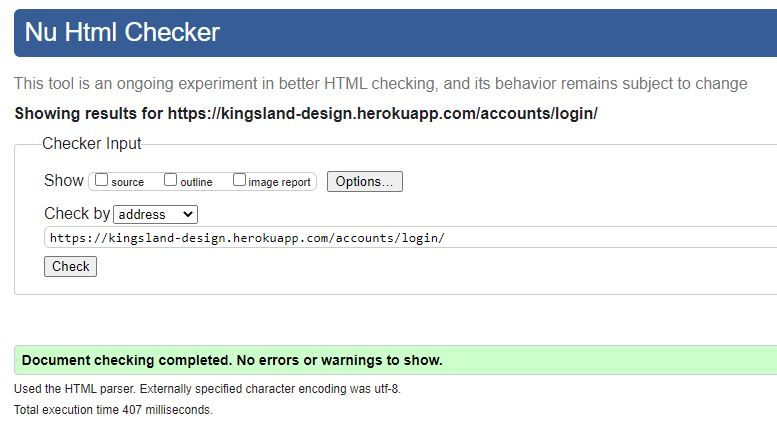
            * Register
                -    

### CSS3
- [CSS code checker](https://jigsaw.w3.org/css-validator/)
- Tests during development, record stored below
    - Test date 21/01/2022
        - CSS test
            * Home
                - 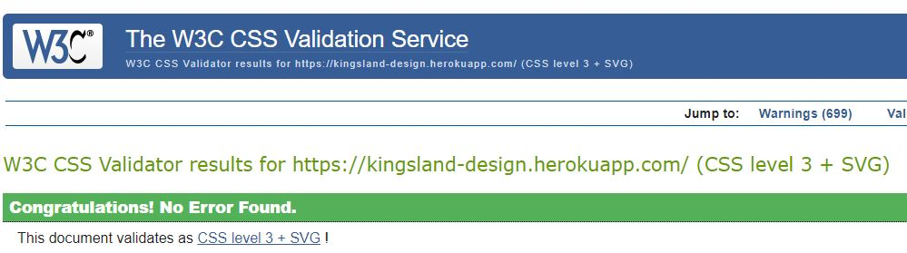
            * Case Studies
                - 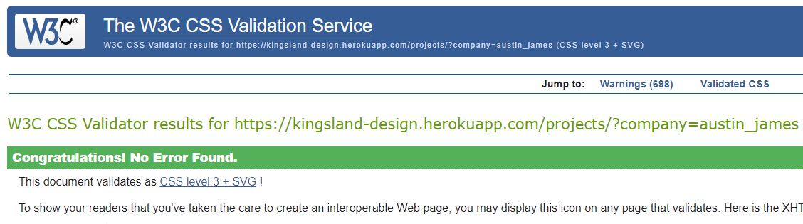
            * Packages
                - 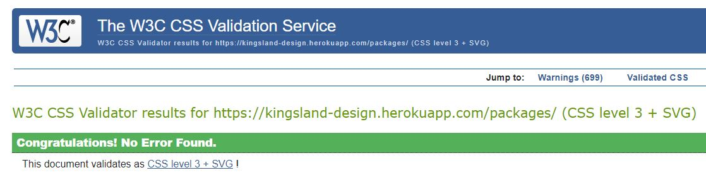
            * Packages Detail
                - 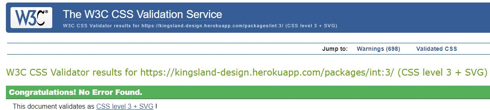
            * Add Package
                - 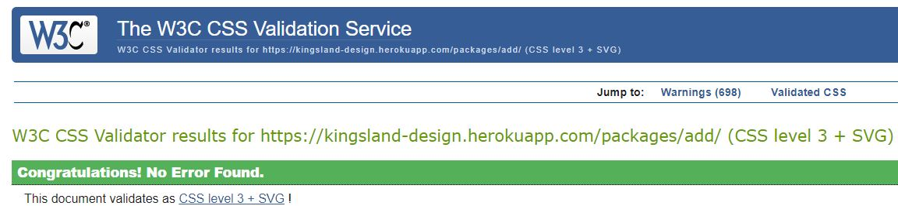
            * Edit Package
                - 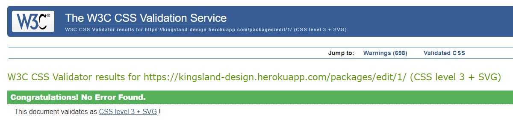          
            * Bag
                - 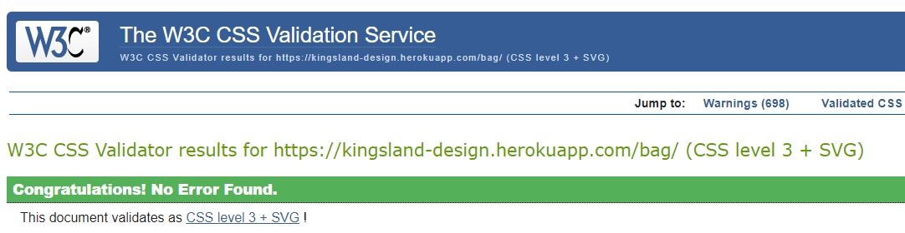
            * Checkout
                - 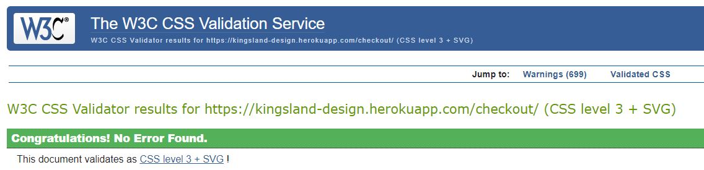
            * Checkout Success
                - 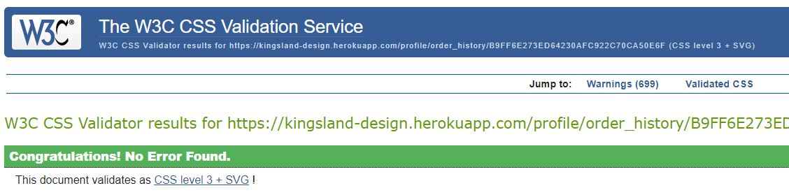
            * Contact 
                - 
            * Profile
                - 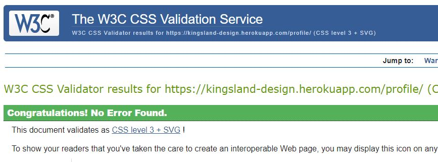
            * Login
                - 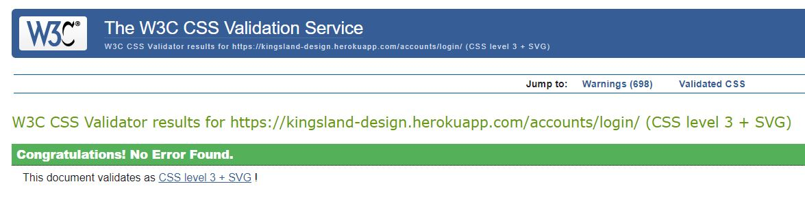
            * Register
                - 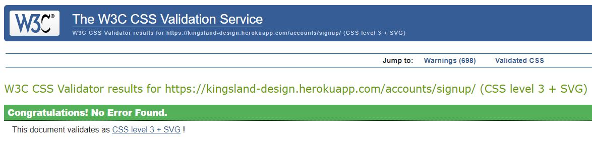  

                
### JavaScript
- [JS Hint JavaScript validator](https://jshint.com/)

    - Test date 21/01/2022
        * All Template scripts
            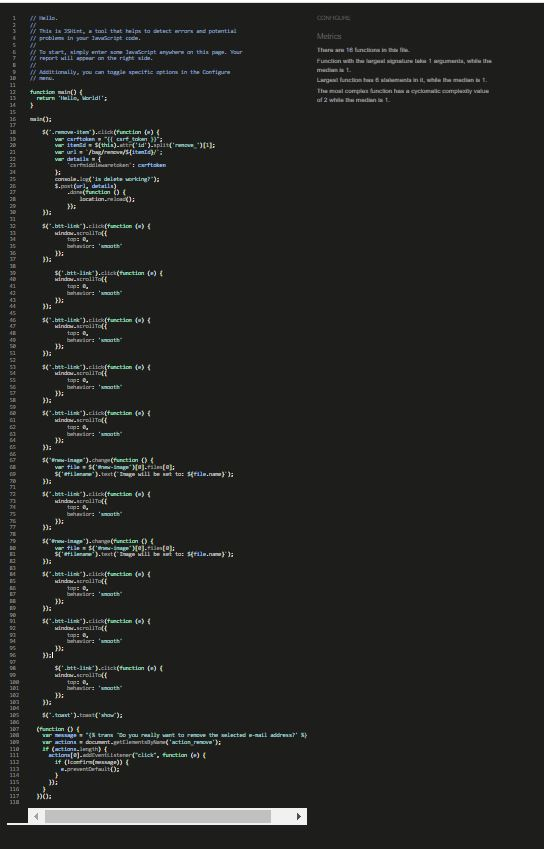
        * Checkout
            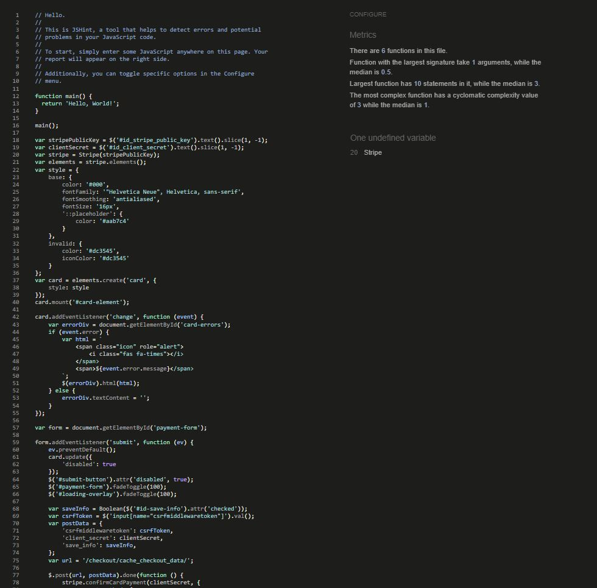
                -   Stripe variable unused, advised to use stripe, however this is taken from a call two lines above under #ID so is usable.
        * Profiles
            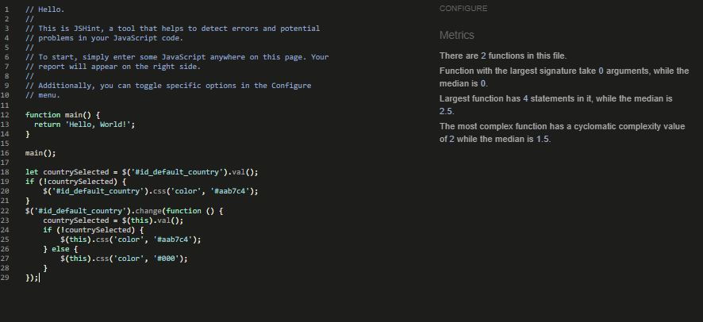
                - 

### PEP8
- Used Django code python3 -m flake8

    - Test date 21/01/2022
        * Code issues
        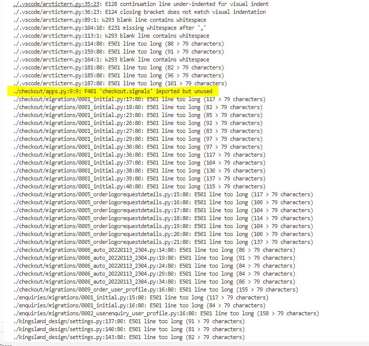
            * import error in checkouts app.py
                * Acceptable linting issue as importing invokes code, however linter doesn't know and so produces an error.

[Back to top ⇧](#top)

## Element testing
### Navigation bar
- Test 
    * Responsive hover on click.
    * Links.

### Scroll Top button
- Test 
    * Button appears on scroll down and when pressed scrolls user to top

### Footer
- Test 
    * Social links change on hover
    * Social links lead to associated sites

[Back to top ⇧](#top)

### Page tests
#### Home
- Image
    * Nav links to other pages
    

[Back to top ⇧](#top)

#### Register
- Image
    * Appealing
- Inputs
    * Email validation
    * Password hidden
    * Link to login if already registered
    * Message success popup
    

#### Login
- Image
    * Appealing
- Inputs
    * Email
    * Password hidden
    * Warning if incorrect
    * Link to Register if not a member
    * Message success popup
    

[Back to top ⇧](#top)

#### Case Studies
- Images
    * Appealing
- Projects
    * Buttons to link to different porjects
    * Description at bottom
    * Link to Packages
    

#### Packages and Package Detail
- Packages available images and text
    * Packages separated
    * admin view to have edit or deactivate/actovate button
        - This so it can be viewed or not by public
    * Ability to select in isolation and consider prior to adding to Bag
    

[Back to top ⇧](#top)

#### Bag
- Package added from Package Detail
    * Popup showing bag updated
    * Bag showing chosen Package
    * Unable to choose another package as one is already selected
        - Popup message stating error and reason
    * Ability to remove and apply a different Package
    

#### Profile
- Profile details
    * First name
    * Last name
    * Email
    * Edit account button
    * Delete Account button - with warning if selected
_ Recipe details
    * Public Recipes
        - View, Edit and Delete Options. Delete to have warning.
    * Private Recipes
        - View, Edit and Delete Options. Delete to have warning.
    

#### Edit Profile
- Ability to amend profile details
    * Cannot amend email as this is used as a username.
        - This can be deleted however
    

[Back to top ⇧](#top)

#### Create Recipe
- Recipe fields
    * Name
    * Description
    * Image (url image address)
    * Recipe type
    * Serves
    * Prep time
    * Cook time
    * Ready time (sum of pre and cook times)
    * Ingredients
        - Food
        - Quantity
        - Size
        - Weight (g)
        - Volume (lb)
    * Method steps
    * Public / Privcy switch
    * Save button
    * Cancel button
        - Warning if cancelling updates will be lost
    

#### Edit Recipe
- Recipe fields update with data previously entered
    * Update of info updates relevant fields
    

[Back to top ⇧](#top)

#### Contact Page
- Image
    * Appealing
- Fields
    * Contact fields are editable
    * All fields are required
    * Email field requires email format
    * Submit button works
    * Pop up appears to show success
    * Contact fields text is removed
    * Position returns to Home after submission
    - 

[Back to top ⇧](#top)

#### Email format
- Test
    * When email is submitted an email is sent to the developer with message from user
    * Auto reply to user stating an email has been received and they will be contacted
    * Email to have a link to the site
    - 

[Back to top ⇧](#top)

### Device testing
- [amiresponsive](http://ami.responsivedesign.is/)
    * Device styles and responsiveness for Mobile, Tablet and Desktop
    

[Back to top ⇧](#top)

### Colour blindness testing

#### Protanopia
- 

#### Deuteranopia
- 

[Back to top ⇧](#top)

### Browser testing
- Microsoft Edge browser testing
    * 

- Firefox browser testing
    * 
    * Nav design circle issue
        - identified d-block was the problem and have isolated in css
        
        

- Safari browser testing
    * Unable to test without making a purchase
    * Have been advised by Friends who own Macs design and interactivity was fine

[Back to top ⇧](#top)

### User testing
- Friends
- Family
- Website Designers

[Back to top ⇧](#top)

<h2 align="center">
    <a href="" target="_blank">Kingsland Website</a>
</h2>

<h3 align="center">
    <a href="https://github.com/TezBaydu/Milestone-Project-4-GraphicDesign#README" target="_blank">Back to README file</a>
</h3>
